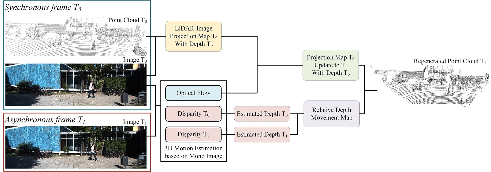

# AF3D: Asynchronous Multi-Modal Fusion based 3D Object Detection


## 1.Introduction

This repository is the PyTorch implementation of the paper :
**Asynchronous Multi-Modal Fusion based 3D Object Detection**.

The code includes 3 parts:

---

**PART0: 00_3DMotionEstimation**:

[*Self-Supervised Monocular Scene Flow Estimation*](http://openaccess.thecvf.com/content_CVPR_2020/papers/Hur_Self-Supervised_Monocular_Scene_Flow_Estimation_CVPR_2020_paper.pdf)  

[Junhwa Hur](https://hurjunhwa.github.io) and [Stefan Roth](https://www.visinf.tu-darmstadt.de/visinf/team_members/sroth/sroth.en.jsp)  | [Paper](http://openaccess.thecvf.com/content_CVPR_2020/papers/Hur_Self-Supervised_Monocular_Scene_Flow_Estimation_CVPR_2020_paper.pdf) | [Supplemental](http://openaccess.thecvf.com/content_CVPR_2020/supplemental/Hur_Self-Supervised_Monocular_Scene_CVPR_2020_supplemental.pdf) | [Arxiv](https://arxiv.org/abs/2004.04143)

 

Features: Scene flow estimation from two temporally consecutive monocular images.

---

**PART1: 01_AF3D**:

<div align="center">
  
</div>

Features: Asynchronous multi-modal fusion to generate LiDAR point cloud for asynchronous frame.

---

**PART2: 02_Unified3DDetection**:

MMDetection3D is an open source object detection toolbox based on PyTorch, towards the next-generation platform for general 3D detection. It is
a part of the OpenMMLab project developed by [MMLab](http://mmlab.ie.cuhk.edu.hk/).

Model Zoo, supported methods and backbones are shown in the below table.

|                    | ResNet   | ResNeXt  | SENet    |PointNet++ | HRNet | RegNetX | Res2Net |
|--------------------|:--------:|:--------:|:--------:|:---------:|:-----:|:--------:|:-----:|
| SECOND             | ☐        | ☐        | ☐        | ✗         | ☐     | ✓        | ☐     |
| PointPillars       | ☐        | ☐        | ☐        | ✗         | ☐     | ✓        | ☐     |
| FreeAnchor         | ☐        | ☐        | ☐        | ✗         | ☐     | ✓        | ☐     |
| VoteNet            | ✗        | ✗        | ✗        | ✓         | ✗     | ✗        | ✗     |
| H3DNet            | ✗        | ✗        | ✗        | ✓         | ✗     | ✗        | ✗     |
| 3DSSD            | ✗        | ✗        | ✗        | ✓         | ✗     | ✗        | ✗     |
| Part-A2            | ☐        | ☐        | ☐        | ✗         | ☐     | ✓        | ☐     |
| MVXNet             | ☐        | ☐        | ☐        | ✗         | ☐     | ✓        | ☐     |
| CenterPoint        | ☐        | ☐        | ☐        | ✗         | ☐     | ✓        | ☐     |
| SSN                | ☐        | ☐        | ☐        | ✗         | ☐     | ✓        | ☐     |

Features: Since image modality is transferred to LiDAR modality, all LiDAR-based, fusion-based 3D object detectors can be applied.

---

PART 4: 03_eAP

---


## 2. Getting Started

### 2.1 Enviroment

Follow the Readme.md of [SceneFlow](https://github.com/Sliverk/AF3D/blob/main/00_3DMotionEstimation/readme.md) and [mm3DDet](https://github.com/Sliverk/AF3D/blob/main/02_Unified3DDetector/README.md) to install the required enviroment.

### 2.2 Dataset

Download the following datasets from KITTI Benchmark.

(1) [KITTI RAW Dataset](https://www.cvlibs.net/datasets/kitti/raw_data.php)


(2) [KITTI 3D Object Detection Dataset](https://www.cvlibs.net/datasets/kitti/eval_object.php?obj_benchmark=3d)

(3) [KITTI Scene Flow Dataset](https://www.cvlibs.net/datasets/kitti/eval_scene_flow.php) (For training Scene Flow Estimation Algorithms, could be ignored.)

Retrive previous frame of 3D object detection dataset
```shell
python3 01_AF3D/01_prepare_data.py

# The following parameter need to be modified:
# dKITTI3D = '../data/kitti_3d'
# dKITTIRAW = '../data/kitti_raw/data_raw'
# dsavepath = '../data/kitti_asyn3d'
# dsaveimage2 = os.path.join(dsavepath,'image_2')
# dsaveimage3 = os.path.join(dsavepath,'image_3')
# dsavevelodyne = os.path.join(dsavepath,'velodyne')
# dsavecalibcam = os.path.join(dsavepath,'calib_cam')
# dsavecalibvelo = os.path.join(dsavepath,'calib_velo')
```

### 2.3 Generate LiDAR for Asynchronous Frame

```shell
# Generate LiDAR 
./00_3DMotionEstimation/scripts/eval_monosf_selfsup_kitti_train.sh --save_disp=True, --save_disp2=True --save_flow=True
```

### 2.3 Asynchronous Multi-Modal Fusion

```shell
# Generate LiDAR 
python3 01_AF3D/02_sceneflow_recover_pcl.py

# The following parameter need to be modified:
# ddisp0 = '../data/monosf_selfsup_kitti_3ddet/disp_0'
# ddisp1 = '../data/monosf_selfsup_kitti_3ddet/disp_1'
# dflow = '../data/monosf_selfsup_kitti_3ddet/flow'
# dasyn3d = '../data/kitti_asyn3d'
# dbinsave = '../data/kitti_asyn3d_recbin'
# dtxtlabel = '../data/kitti_3d/training/label_2'
# dtxtcalib = '../data/kitti_3d/training/calib'
```

### 2.4 3D Object Detection

```shell
# Train generated LiDAR/LiDAR
python3 tools/train.py ${CONFIG_FILE} --work_dir ${YOUR_WORK_DIR} [optional arguments]
```

```shell
# Validation
python3 tools/test.py ${CONFIG_FILE} ${CHECKPOINT_FILE} [--out ${RESULT_FILE}] [--eval ${EVAL_METRICS}] [--show]
```

Follow the [instruction](https://github.com/Sliverk/AF3D/blob/main/02_Unified3DDetector/docs/1_exist_data_model.md) of mm3DDet. 


### 2.5 Metric for Evaluation

```shell
# Evaluation 
python3 04_eAP/demo.py
```


